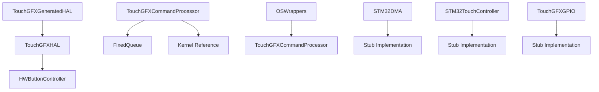
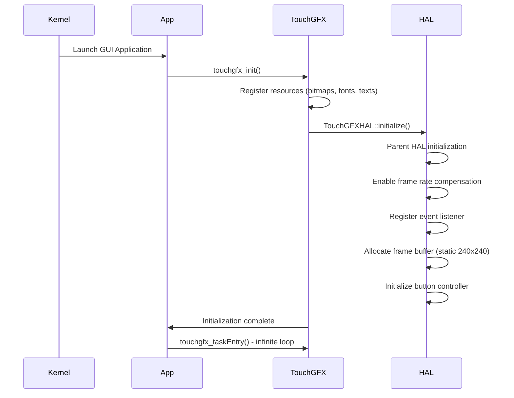
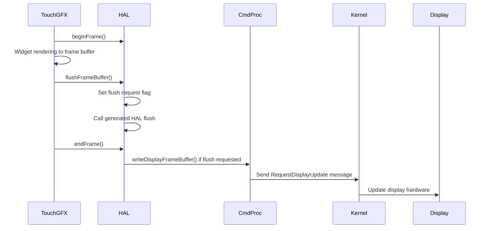
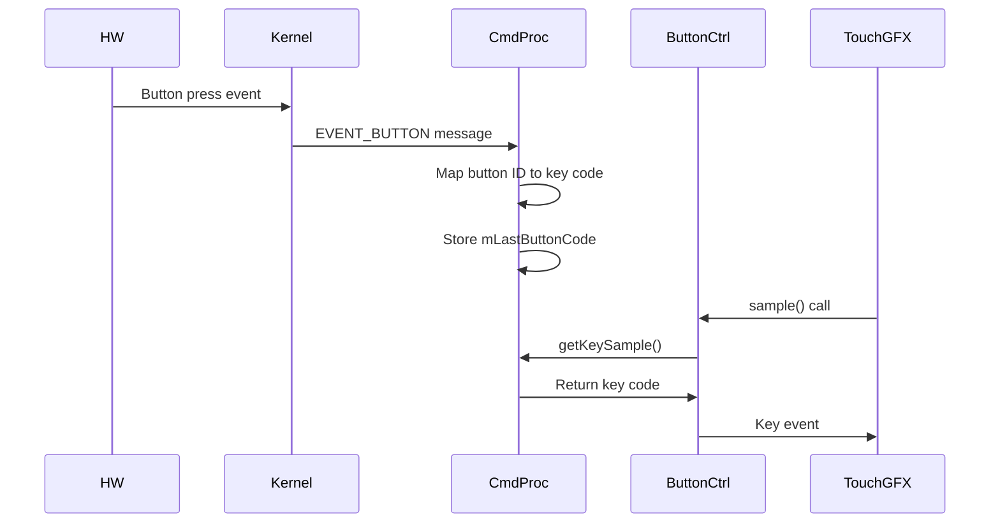
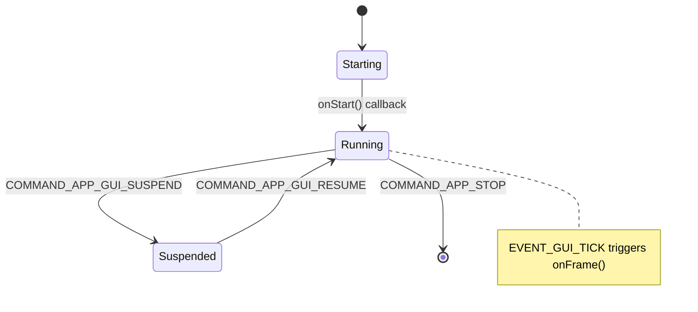
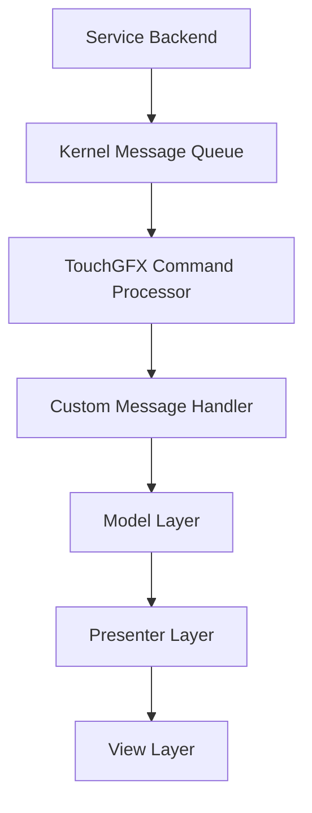

# TouchGFX Port Architecture

## Table of Contents

1. [Overview](#overview)
2. [Definitions and Terminology](#definitions-and-terminology)
3. [Structural Architecture](#structural-architecture)
4. [API Structure](#api-structure)
5. [Behavioral Architecture](#behavioral-architecture)
   - [Initialization Flow](#initialization-flow)
   - [Rendering Flow](#rendering-flow)
   - [Input Handling](#input-handling)
   - [Lifecycle Management](#lifecycle-management)
   - [Data Flows](#data-flows)
6. [UNA-Specific System Integration Points](#una-specific-system-integration-points)
7. [Application Architecture Guidelines](#application-architecture-guidelines)
8. [Custom Message Communication](#custom-message-communication)
9. [Project Structure and Build Integration](#project-structure-and-build-integration)

## Overview

The TouchGFX port implementation for the UNA SDK provides a comprehensive hardware abstraction layer (HAL) that seamlessly integrates the TouchGFX GUI framework into the UNA platform (see [Architecture Deep Dive](architecture-deep-dive.md)). This port empowers developers to create sophisticated graphical user interfaces for UNA-based applications, leveraging TouchGFX's extensive widget library and rendering capabilities.

The implementation comprises custom HAL classes that extend TouchGFX-generated code, a robust command processor for kernel integration, and stub implementations for hardware interfaces not currently utilized in the UNA platform configuration. The port supports a 240x240 pixel display with 8-bit color depth using ABGR2222 format, software-based rendering, and button-based input handling through the UNA kernel messaging system.

Key architectural principles include:
- **Modular Design**: Separation between TouchGFX framework and UNA platform specifics
- **Message-Based Communication**: Asynchronous integration with the UNA kernel
- **Extensibility**: Support for future hardware customizations and additional TouchGFX features
- **Performance Optimization**: Efficient resource usage within platform constraints

## Definitions and Terminology

- **ABGR2222**: A 8-bit color format where each pixel uses 2 bits per channel (Alpha, Blue, Green, Red) for compact color representation
- **UNA Kernel**: The core operating system component of the UNA platform, responsible for task scheduling, messaging, and hardware abstraction
- **Stub Implementation**: A minimal, non-functional implementation of an interface, used when the corresponding hardware or feature is not available
- **Frame Buffer**: A memory region storing pixel data for display rendering
- **VSync (Vertical Synchronization)**: Synchronization signal ensuring display updates occur at the correct refresh rate
- **HAL (Hardware Abstraction Layer)**: Software layer that provides a consistent interface to hardware components
- **Frontend Heap**: Memory allocation system used by TouchGFX for dynamic GUI elements
- **Message Queue**: A fixed-size buffer (capacity: 10 messages) for storing kernel messages in the TouchGFX command processor

## Structural Architecture

### Class Hierarchy



### Key Classes and Interfaces

#### TouchGFXHAL
The TouchGFXHAL serves as the main hardware abstraction layer, extending the TouchGFX-generated HAL to provide UNA platform-specific customizations for frame buffer management, button controller integration, and display operations.
- **Location**: `Libs/Source/Port/TouchGFX/TouchGFXHAL.cpp`, `Libs/Header/SDK/Port/TouchGFX/TouchGFXHAL.hpp`
- **Purpose**: Main hardware abstraction layer extending TouchGFXGeneratedHAL
- **Key Responsibilities**:
  - Frame buffer management and allocation
  - Button controller integration
  - Display initialization and configuration
  - Interrupt handling (delegated to generated HAL)
  - Frame synchronization and flushing

#### TouchGFXCommandProcessor
The TouchGFXCommandProcessor acts as the central command processor and lifecycle manager, implementing a singleton pattern to handle kernel message processing, GUI lifecycle management, and frame synchronization.
- **Location**: `Libs/Source/Port/TouchGFX/TouchGFXCommandProcessor.cpp`, `Libs/Header/SDK/Port/TouchGFX/TouchGFXCommandProcessor.hpp`
- **Purpose**: Central command processor and lifecycle manager (singleton pattern)
- **Key Responsibilities**:
  - Kernel message processing and routing
  - GUI lifecycle management (start/stop/resume/suspend)
  - Button event handling and translation
  - Custom message routing
  - Frame synchronization via VSync
  - Display update message sending

#### HWButtonController
The HWButtonController provides button input handling for TouchGFX, sampling button states from the command processor and translating UNA button events to TouchGFX key codes through polled input handling.
- **Location**: `Libs/Source/Port/TouchGFX/TouchGFXHAL.cpp` (nested class)
- **Purpose**: Button input controller for TouchGFX
- **Key Responsibilities**:
  - Sampling button states from command processor
  - Translating UNA button events to TouchGFX key codes
  - Polled input handling

#### Generated and Stub Classes

- **TouchGFXGeneratedHAL**: Base HAL implementation generated by TouchGFX tools
- **OSWrappers**: Operating system abstraction layer bridging TouchGFX to UNA kernel
- **STM32DMA**: DMA interface (stub implementation - not supported)
- **STM32TouchController**: Touch input controller (stub implementation - not implemented)
- **TouchGFXGPIO**: GPIO interface (stub implementation - not utilized)

### Data Structures
- **Frame Buffer**: Static `uint8_t sFrameBuffer[57600]` (240×240×1 byte/pixel)
- **Active Buffer Pointer**: `uint8_t* spActiveBuffer`
- **Flush Request Flag**: `bool sFlushBufferReq`
- **Button State**: `uint8_t mLastButtonCode`
- **Message Queue**: `FixedQueue<MessageBase*, 10> mUserQueue` for custom messages
- **Kernel Reference**: Direct access to UNA kernel for messaging

## API Structure

### Public Interfaces

#### TouchGFXHAL
The TouchGFXHAL class extends the TouchGFX-generated HAL to provide UNA platform-specific customizations, including frame buffer management, button controller integration, and display initialization.
```cpp
class TouchGFXHAL : public TouchGFXGeneratedHAL {
public:
    TouchGFXHAL(DMA_Interface& dma, LCD& display, TouchController& tc, uint16_t width, uint16_t height);
    virtual void initialize();
    virtual void disableInterrupts();
    virtual void enableInterrupts();
    virtual void configureInterrupts();
    virtual void enableLCDControllerInterrupt();
    virtual bool beginFrame();
    virtual void endFrame();
    virtual void flushFrameBuffer();
    virtual void flushFrameBuffer(const Rect& rect);
    virtual bool blockCopy(void* dest, const void* src, uint32_t numBytes);

protected:
    virtual uint16_t* getTFTFrameBuffer() const;
    virtual void setTFTFrameBuffer(uint16_t* adr);
};
```

#### TouchGFXCommandProcessor
The TouchGFXCommandProcessor serves as a singleton managing global GUI state, handling kernel message processing, lifecycle management, and button event translation.
```cpp
class TouchGFXCommandProcessor {
public:
    static TouchGFXCommandProcessor& GetInstance();
    void setAppLifeCycleCallback(IGuiLifeCycleCallback* cb);
    void setCustomMessageHandler(ICustomMessageHandler* h);
    bool waitForFrameTick();
    bool getKeySample(uint8_t& key);
    void writeDisplayFrameBuffer(const uint8_t* data);
    void callCustomMessageHandler();
};
```

### Configuration Functions
The port provides initialization functions for setting up the TouchGFX framework, registering resources, and establishing the main GUI task entry point: [`Libs\Source\AppSystem\EntryPoint\TouchGFX\main.cpp`](Libs\Source\AppSystem\EntryPoint\TouchGFX\main.cpp)
- `touchgfx_init()`: Initializes TouchGFX framework, registers resources
- `touchgfx_taskEntry()`: Main GUI task entry point (infinite loop)
- `touchgfx_components_init()`: Component initialization (currently empty)

### Key Relationships
- **TouchGFXHAL** extends **TouchGFXGeneratedHAL** for UNA-specific customizations
- **TouchGFXCommandProcessor** acts as a singleton managing global GUI state
- **HWButtonController** polls **TouchGFXCommandProcessor** for input
- **OSWrappers** delegates VSync waiting to **TouchGFXCommandProcessor**
- Generated classes provide minimal base implementations with stub functionality

### Design Patterns

#### Singleton Pattern
- **TouchGFXCommandProcessor**: Ensures single instance managing global GUI state
- Provides centralized access to command processing and lifecycle management

#### Adapter Pattern
- **TouchGFXHAL**: Adapts TouchGFX HAL interface to UNA platform specifics
- **HWButtonController**: Translates UNA button events to TouchGFX input system

#### Template Method Pattern
- **TouchGFXHAL** overrides specific methods while delegating others to generated base class
- Enables customization of key behaviors while maintaining framework compatibility

#### Observer Pattern
- **Event Listeners**: HAL registers with TouchGFX Application for framework events
- **Lifecycle Callbacks**: Command processor notifies registered callbacks of state changes

#### Bridge Pattern
- **OSWrappers**: Bridges TouchGFX OS requirements to UNA kernel primitives
- Separates platform-specific OS operations from framework logic

## Behavioral Architecture

### Initialization Flow



1. **Application Startup**: UNA kernel launches the GUI application process
2. **TouchGFX Initialization**: Framework configuration including resource registration and HAL setup
   - `touchgfx_init()` configures the framework
   - Bitmap database, text resources, and font providers are registered
   - Frontend heap is initialized for dynamic allocations
   - HAL is initialized via `TouchGFXHAL::initialize()`
3. **HAL Setup**: Hardware abstraction layer initialization with frame buffer allocation and controller configuration
   - Parent generated HAL initialization
   - Frame rate compensation enabled for smooth rendering
   - Event listener registered with TouchGFX Application
   - Static frame buffer allocated (240×240×1 byte)
   - Button controller initialized and configured

### Rendering Flow



1. **Frame Start**: `HAL::beginFrame()` prepares for rendering
2. **Drawing Operations**: TouchGFX widgets render directly to the frame buffer
3. **Frame Flush**: `TouchGFXHAL::flushFrameBuffer()` is called
   - Sets internal flush request flag
   - Delegates to generated HAL for framework notification
4. **Display Update**: Command processor sends display update message to kernel
5. **Frame End**: `HAL::endFrame()` completes the frame cycle

### Input Handling



1. **Button Events**: Hardware button presses generate kernel `EVENT_BUTTON` messages
2. **Event Processing**: Command processor receives and processes button events
3. **Key Mapping**: Button IDs are translated to TouchGFX key codes:
   - SW1 → '1'
   - SW2 → '3'
   - SW3 → '2'
   - SW4 → '4'
4. **Sampling**: `HWButtonController::sample()` retrieves the last button code via `getKeySample()`

### Lifecycle Management



1. **Start**: `onStart()` callback invoked on first frame tick
2. **Resume/Suspend**: Handled via kernel commands with corresponding callbacks
3. **Stop**: `onStop()` callback executed, application terminates
4. **Frame Ticks**: `EVENT_GUI_TICK` messages trigger `onFrame()` callbacks for rendering

### Data Flows

#### Rendering Data Flow
```
TouchGFX Widgets → Frame Buffer (uint8_t[57600]) → flushFrameBuffer() → Display Update Message → Kernel → Display Hardware
```

#### Input Data Flow
```
Hardware Buttons → Kernel → EVENT_BUTTON Message → TouchGFXCommandProcessor.mLastButtonCode → HWButtonController → TouchGFX Key Events
```

#### Lifecycle Data Flow
```
Kernel Commands (START/STOP/RESUME/SUSPEND) → TouchGFXCommandProcessor → Lifecycle Callbacks → TouchGFX Application
```

#### VSync Synchronization
```
Kernel → EVENT_GUI_TICK Message → TouchGFXCommandProcessor.waitForFrameTick() → OSWrappers.waitForVSync() → TouchGFX Frame Processing
```
### Advanced Configuration
- **Custom Message Handling**: Implement `ICustomMessageHandler` for application-specific messages
- **Button Mapping**: Modify `TouchGFXCommandProcessor::handleEvent()` for custom key mappings
- **Display Parameters**: Adjust frame buffer size in `TouchGFXHAL.cpp` if display resolution changes. Note that the buffer cannot be adjusted on the fly as it is statically allocated. The display size parameters are intended to verify that the application has correctly set the size and may support multiple display options in the future. Note that the buffer cannot be adjusted on the fly as it is statically allocated. The display size parameters are intended to verify that the application has correctly set the size and may support multiple display options in the future.

## Error Handling and Debugging

### Common Issues and Troubleshooting

| Issue | Symptoms | Solution |
|-------|----------|----------|
| GUI not starting | Application hangs on startup | Check kernel messaging setup, verify TouchGFX resources |
| Display not updating | Screen remains blank | Verify frame buffer allocation, check display update messages |
| Button input not working | Buttons don't respond | Check button mapping in `handleEvent()`, verify kernel button events |
| Memory allocation failures | Application crashes | Ensure sufficient heap space for TouchGFX allocations |
| Frame rate issues | Jerky animation | Check VSync timing, verify `EVENT_GUI_TICK` frequency |

### Debugging Techniques
- **Logging**: Enable debug logging in `TouchGFXCommandProcessor` for message flow tracing
- **Frame Buffer Inspection**: Add debug output to inspect frame buffer contents
- **Message Queue Monitoring**: Track queue usage to detect overflow conditions
- **Performance Profiling**: Implement profiling methods to measure the percentage of time the app spends sleeping while waiting for messages, such as tracking sleep durations in the message loop.

### Error Codes and Messages
- **Queue Full**: Custom message queue reaches capacity (10 messages) - oldest message discarded
- **Invalid Message Type**: Unknown kernel message received - logged and ignored
- **Display Update Failure**: Frame buffer write fails - check kernel communication

## Extensibility and Customization Guide

### Adding Future Hardware Support
1. **Extend HAL**: Create custom HAL class inheriting from `TouchGFXHAL`
2. **Implement Interfaces**: Override methods for new hardware (e.g., DMA, touch)
3. **Update Stubs**: Replace stub implementations with functional code

### Custom Message Handling
Custom messages are handled through a queue due to the peculiarities of the TouchGFX frame cycle. All user events that affect the state of screens or their switching must occur between the beginning and end of the frame, that is, when we are NOT in TouchGFXCommandProcessor::waitForFrameTick(). Therefore, direct calls to mCustomMessageHandler->customMessageHandler(msg) are not used; instead, messages are queued and processed at the appropriate time.

```cpp
class MyCustomHandler : public ICustomMessageHandler {
public:
    bool customMessageHandler(MessageBase* msg) override {
        switch (msg->getType()) {
            case MY_CUSTOM_MESSAGE_TYPE:
                // Handle custom message
                return true;
            default:
                return false;
        }
    }
};

// Register handler
cmdProc.setCustomMessageHandler(new MyCustomHandler());
```

### Button Customization
Modify `TouchGFXCommandProcessor::handleEvent()` to change key mappings for custom button handling. Note that adding new physical buttons is unlikely, but users can adjust key mappings for their convenience. Note that adding new physical buttons is unlikely, but users can adjust key mappings for their convenience.

### Display Configuration
Adjust `skWidth`, `skHeight`, and `skBufferSize` in `TouchGFXHAL.cpp` for different display sizes.

## UNA-Specific System Integration Points

The UNA SDK extends standard TouchGFX with comprehensive system integration capabilities that enable seamless operation within the UNA platform ecosystem. These integration points provide the foundation for building sophisticated embedded applications with proper lifecycle management, inter-process communication, and resource coordination.

### Overall Architecture Characteristics

#### Hardware Configuration
- **Display**: 240×240 pixels, 8-bit color (ABGR2222 format)
- **Frame Buffer**: Single static buffer, software rendering only
- **DMA**: Not supported (stub implementation)
- **Touch Input**: Not implemented (stub controller)
- **GPIO**: Not utilized (stub implementation)

#### Performance Characteristics
- **Rendering**: Software-based, no hardware acceleration available yet.
- **Memory Usage**: ~57.6 KB static frame buffer + dynamic allocations
- **Synchronization**: Kernel-driven VSync via messaging system
- **Input Handling**: Polled button sampling, no interrupt-driven input
- **Threading Model**: Single-threaded GUI execution

#### Integration Approach
- **Kernel Integration**: Asynchronous message-based communication
- **Lifecycle Management**: Command processor handles complete application lifecycle
- **Threading**: Single-threaded execution within GUI task
- **Resource Management**: Frontend heap for TouchGFX dynamic allocations

#### Extensibility Features
- **Custom Messages**: Support for application-specific kernel messages via queue
- **Lifecycle Callbacks**: Configurable start/stop/resume/suspend event handlers
- **Hardware Abstraction**: Modular HAL design enables platform customization
- **Stub Architecture**: Easy replacement of non-implemented features

#### Limitations and Constraints
- **No Hardware Acceleration**: Software rendering limits performance for complex UIs
- **No Touch Support**: Button-only input, no gesture recognition
- **No DMA**: Memory copies use CPU, potential bottleneck for large transfers
- **Single Buffer**: No double buffering, may cause tearing if not synchronized properly
- **Fixed Resolution**: Currently optimized for 240×240 displays only

### Core Integration Components

#### TouchGFXCommandProcessor

The TouchGFXCommandProcessor serves as a singleton command processor that acts as the central hub for UNA kernel integration, providing asynchronous message-based communication, lifecycle event handling, and frame buffer update coordination.
- **Location**: [`Libs/Source/Port/TouchGFX/TouchGFXCommandProcessor.cpp:25-77`](Libs/Source/Port/TouchGFX/TouchGFXCommandProcessor.cpp:25), [`Libs/Header/SDK/Port/TouchGFX/TouchGFXCommandProcessor.hpp:35-76`](Libs/Header/SDK/Port/TouchGFX/TouchGFXCommandProcessor.hpp:35)
- **Purpose**: Singleton command processor that serves as the central hub for UNA kernel integration
- **Key Features**:
  - Asynchronous message-based communication with UNA kernel
  - Fixed-size message queue (capacity: 10 messages, configurable) for custom application messages
  - Lifecycle event handling (start/stop/resume/suspend)
  - Button event processing and sampling
  - Frame buffer update coordination

**Technical Implementation Details:**
```cpp
// Singleton instance management
TouchGFXCommandProcessor& TouchGFXCommandProcessor::GetInstance() {
    static TouchGFXCommandProcessor sInstance;
    return sInstance;
}

// Message processing loop (simplified)
bool TouchGFXCommandProcessor::waitForFrameTick() {
    while (true) {
        SDK::MessageBase* msg = nullptr;
        if (!mKernel.comm.getMessage(msg)) {
            continue; // Block until message available
        }

        switch (msg->getType()) {
            case SDK::MessageType::EVENT_GUI_TICK:
                // Process frame tick
                if (mAppLifeCycleCallback) {
                    mAppLifeCycleCallback->onFrame();
                }
                return false; // Allow TouchGFX to render
            // ... other message types
        }
    }
}
```

#### Kernel Message Processing

**Message Structure Details:**
The port handles various kernel message types for lifecycle management, input processing, and display updates, providing seamless integration between TouchGFX and the UNA kernel messaging system.

**EventButton Message Structure:**
```cpp
// From Libs/Header/SDK/Messages/CommandMessages.hpp:462-501
struct EventButton : public MessageBase {
    enum class Id : uint8_t {
        SW1 = 0, SW2, SW3, SW4  // Physical button identifiers
    };

    enum class Event : uint8_t {
        PRESS = 0, RELEASE, CLICK, LONG_PRESS, HOLD_1S, HOLD_5S, HOLD_10S
    };

    uint32_t timestamp;  // Event timestamp
    Id id;              // Which button (SW1-SW4)
    Event event;        // Event type (CLICK used for TouchGFX)
};
```

**Button Mapping Implementation:**
```cpp
// From Libs/Source/Port/TouchGFX/TouchGFXCommandProcessor.cpp:189-205
void TouchGFXCommandProcessor::handleEvent(SDK::Message::EventButton* msg) {
    if (!mIsGuiResumed) {
        mLastButtonCode = '\0';
        return;
    }

    if (msg->event == SDK::Message::EventButton::Event::CLICK) {
        switch (msg->id) {
            case SDK::Message::EventButton::Id::SW1: mLastButtonCode = '1'; break;
            case SDK::Message::EventButton::Id::SW2: mLastButtonCode = '3'; break;
            case SDK::Message::EventButton::Id::SW3: mLastButtonCode = '2'; break;
            case SDK::Message::EventButton::Id::SW4: mLastButtonCode = '4'; break;
        }
    }
}
```

**RequestDisplayUpdate Message Structure:**
```cpp
// From Libs/Header/SDK/Messages/CommandMessages.hpp:293-306
struct RequestDisplayUpdate : public MessageBase {
    const uint8_t* pBuffer;  // Pointer to 240x240x1 byte frame buffer
    int16_t x, y;            // Update region (unused, always full screen)
    int16_t width, height;   // Region size (unused, always 0 for full update)

    RequestDisplayUpdate()
        : MessageBase(MessageType::REQUEST_DISPLAY_UPDATE)
        , pBuffer(nullptr), x(0), y(0), width(0), height(0) {}
};
```

**Frame Buffer Update Implementation:**
```cpp
// From Libs/Source/Port/TouchGFX/TouchGFXCommandProcessor.cpp:157-169
void TouchGFXCommandProcessor::writeDisplayFrameBuffer(const uint8_t* data) {
    if (!data || !mIsGuiResumed) {
        return;  // Don't update if suspended or invalid data
    }

    auto* msg = mKernel.comm.allocateMessage<SDK::Message::RequestDisplayUpdate>();
    if (msg) {
        msg->pBuffer = data;  // Pass frame buffer pointer
        mKernel.comm.sendMessage(msg, 1000);  // Send with 1s timeout
        mKernel.comm.releaseMessage(msg);
    }
}
```

- **Message Types Handled**:
  - `COMMAND_APP_STOP`: Graceful application termination with cleanup
  - `EVENT_GUI_TICK`: Frame synchronization and rendering triggers
  - `EVENT_BUTTON`: Physical button input processing (SW1-SW4 mapping)
  - `COMMAND_APP_GUI_RESUME/SUSPEND`: GUI state management
  - Custom application-specific messages via extensible queue system
- **Integration**: Direct kernel communication through `SDK::Kernel` interface

#### Hardware Abstraction Layer Extensions

The custom HAL implementation provides kernel-driven frame buffer management, button controller integration, and VSync synchronization to ensure proper display updates and input handling within the UNA platform.
- **Custom HAL Implementation**: [`Libs/Source/Port/TouchGFX/TouchGFXHAL.cpp:67-87`](Libs/Source/Port/TouchGFX/TouchGFXHAL.cpp:67)
  - Kernel-driven frame buffer flushing via `writeDisplayFrameBuffer()`
  - Button controller integration with kernel message sampling
  - Static frame buffer allocation (57.6 KB for 240×240×8-bit)
  - VSync synchronization through kernel messaging

**HAL Frame Buffer Management:**
```cpp
// From Libs/Source/Port/TouchGFX/TouchGFXHAL.cpp:53-64
static const int16_t skWidth = 240;
static const int16_t skHeight = 240;
static const uint32_t skBufferSize = skWidth * skHeight;  // 57,600 bytes

static uint8_t sFrameBuffer[skBufferSize];  // Static allocation
static uint8_t* spActiveBuffer;
static bool sFlushBufferReq;

// Frame buffer initialization
void TouchGFXHAL::initialize() {
    HAL::initialize();
    spActiveBuffer = sFrameBuffer;
    setFrameBufferStartAddresses((void*)spActiveBuffer, nullptr, nullptr);
}
```

**Flush Mechanism:**
The HAL implements a deferred flush mechanism that coordinates frame buffer updates with the kernel display system, ensuring efficient rendering and display synchronization.
```cpp
// From Libs/Source/Port/TouchGFX/TouchGFXHAL.cpp:128-142
void TouchGFXHAL::flushFrameBuffer(const touchgfx::Rect& rect) {
    sFlushBufferReq = true;  // Set flag for endFrame()
    TouchGFXGeneratedHAL::flushFrameBuffer(rect);
}

// From Libs/Source/Port/TouchGFX/TouchGFXHAL.cpp:203-216
void TouchGFXHAL::endFrame() {
    if (sFlushBufferReq) {
        // Send frame buffer to kernel for display
        SDK::TouchGFXCommandProcessor::GetInstance()
            .writeDisplayFrameBuffer(spActiveBuffer);
        sFlushBufferReq = false;
    }
    TouchGFXGeneratedHAL::endFrame();
}
```

#### Operating System Wrappers

The OS wrappers provide the bridge between TouchGFX OS requirements and UNA kernel primitives, handling VSync synchronization, task scheduling, and timing operations.
- **Location**: [`Libs/Source/Port/TouchGFX/generated/OSWrappers.cpp:105-108`](Libs/Source/Port/TouchGFX/generated/OSWrappers.cpp:105)
- **UNA-Specific Functions**:
  - `waitForVSync()`: Blocks until kernel sends GUI tick message
  - `taskDelay()`: Uses kernel delay functionality
  - `taskYield()`: Kernel-based task scheduling

**VSync Implementation:**
```cpp
// From Libs/Source/Port/TouchGFX/generated/OSWrappers.cpp:105-108
void OSWrappers::waitForVSync() {
    // Delegate to command processor message loop
    SDK::TouchGFXCommandProcessor::GetInstance().waitForFrameTick();
}
```

### Application Lifecycle Management

#### Lifecycle Callbacks

The port provides lifecycle callback interfaces that enable applications to respond to GUI state changes, including start, stop, resume, suspend, and frame events for proper application management.
- **Interface**: `SDK::Interface::IGuiLifeCycleCallback`
- **Events**:
  - `onStart()`: Called once when GUI application begins
  - `onStop()`: Called during application termination for cleanup
  - `onResume()`: GUI reactivation after suspension
  - `onSuspend()`: GUI deactivation
  - `onFrame()`: Called each frame for application logic

**Lifecycle State Machine:**
```cpp
// From Libs/Source/Port/TouchGFX/TouchGFXCommandProcessor.cpp:25-32
TouchGFXCommandProcessor::TouchGFXCommandProcessor()
    : mKernel(SDK::KernelProviderGUI::GetInstance().getKernel())
    , mStartCallbackCalled(false)
    , mIsGuiResumed(false)
    , mLastButtonCode(0)
    , mAppLifeCycleCallback(nullptr)
    , mCustomMessageHandler(nullptr) {}
```

#### Custom Message Handling

The port supports custom message handling interfaces that allow applications to process application-specific kernel messages through a dedicated message queue system.
- **Interface**: `SDK::Interface::ICustomMessageHandler`
- **Purpose**: Enables application-specific kernel message processing
- **Implementation**: `customMessageHandler()` method for processing queued messages

**Message Queue Implementation:**
```cpp
// From Libs/Header/SDK/Port/TouchGFX/TouchGFXCommandProcessor.hpp:73
SDK::Tools::FixedQueue<SDK::MessageBase*, 10> mUserQueue {};

// Queue processing in message loop
void TouchGFXCommandProcessor::callCustomMessageHandler() {
    while (!mUserQueue.empty()) {
        auto v = mUserQueue.pop();
        if (v) {
            auto msg = *v;
            bool result = false;
            if (mCustomMessageHandler) {
                result = mCustomMessageHandler->customMessageHandler(msg);
            }
            // Send response back to kernel
            msg->setResult(result ? SUCCESS : FAIL);
            mKernel.comm.sendResponse(msg);
            mKernel.comm.releaseMessage(msg);
        }
    }
}
```

### Performance Implications and Optimizations

#### Memory Management
- **Static Frame Buffer**: 57.6 KB pre-allocated to avoid heap fragmentation
- **Fixed Message Queue**: 10-message capacity prevents unbounded growth
- **Frontend Heap**: TouchGFX avoids dynamic allocations out of the box, with screens created in pre-allocated buffers. The kernel tracks and cleans up user-created dynamic allocations to prevent leaks.

**Performance Characteristics:**
- **Frame Rate**: Limited by kernel tick frequency (typically 30-60 FPS)
- **CPU Usage**: Software rendering + message processing overhead
- **Memory Footprint**: ~64 KB total (frame buffer + TouchGFX overhead)
- **Latency**: Button input delayed by message processing (~1-2ms). Additionally, buttons are processed through a 50-60ms debounce filter and react only upon release.

#### Synchronization Optimizations
- **Kernel-Driven VSync**: Eliminates polling, reduces power consumption
- **Asynchronous Display Updates**: Non-blocking frame buffer submission
- **Message Prioritization**: Currently, there is no explicit prioritization except for lifecycle events, which use an additional queue separate from user events.

#### Error Handling and Recovery
- **Queue Overflow Protection**: Oldest messages discarded with logging
- **Timeout Handling**: Display update messages have 1-second timeout
- **Graceful Degradation**: GUI suspends on communication failures

### Additional Integration Points

#### Memory Management Integration
- **Frontend Heap Monitoring**: Integration with UNA memory tracking
- **Resource Cleanup**: Automatic cleanup on application termination
- **Leak Prevention**: Static allocations avoid dynamic memory issues

#### Error Handling and Diagnostics
- **Message Logging**: All kernel communications logged for debugging
- **State Validation**: GUI state checked before processing messages
- **Recovery Mechanisms**: Automatic resume after transient failures

#### Power Management Integration
- **Suspend/Resume Handling**: Proper power state transitions
- **Display Control**: Backlight and display power managed by kernel
- **Idle Detection**: TouchGFX animations paused during suspend

## Application Architecture Guidelines

This section provides comprehensive guidelines for developing TouchGFX applications within the UNA SDK framework, ensuring optimal performance, maintainability, and integration with the platform's architecture.

### Application Structure Best Practices

#### MVP Pattern Implementation
The UNA SDK enforces a strict Model-View-Presenter (MVP) pattern for TouchGFX applications:

```cpp
// Model: Business logic and data management
class Model : public ModelListener {
public:
    void updateHeartRate(uint16_t bpm) {
        mHeartRate = bpm;
        modelListener->notifyHeartRateChanged(bpm);
    }
private:
    uint16_t mHeartRate;
};

// View: UI rendering and user interaction
class MainView : public MainViewBase {
public:
    void handleKeyEvent(uint8_t key) override {
        presenter->handleButtonPress(key);
    }
    void updateHeartRate(uint16_t bpm) {
        // Update UI elements
        heartRateText.setWildcard(bpm);
        heartRateText.invalidate();
    }
};

// Presenter: Coordination between Model and View
class MainPresenter : public Presenter, public ModelListener {
public:
    void handleButtonPress(uint8_t key) {
        switch (key) {
            case '1': model->startMeasurement(); break;
            case '2': model->stopMeasurement(); break;
        }
    }
    void notifyHeartRateChanged(uint16_t bpm) override {
        view.updateHeartRate(bpm);
    }
};
```

**Key Principles:**
- **Model Independence**: Models should not reference View or Presenter classes
- **Single Responsibility**: Each class has one clear purpose
- **Interface Segregation**: Use interfaces for communication between layers
- **Testability**: MVP enables unit testing of business logic

#### Screen Management
- **Screen Inheritance**: All screens inherit from generated `*ViewBase` classes
- **Resource Management**: Initialize UI elements in `setupScreen()`, clean up in `tearDownScreen()`
- **State Persistence**: Use Model for data that survives screen transitions
- **Transition Coordination**: Presenters handle screen switching logic

### Performance Optimization Guidelines

#### Memory Management
- **Static Allocations**: Prefer static frame buffer over dynamic allocation
- **Pool Allocation**: Use TouchGFX's internal memory pools for widgets
- **Resource Sharing**: Reuse bitmap and font resources across screens
- **Heap Monitoring**: Track memory usage during development

#### Rendering Optimization
- **Invalidate Strategically**: Only invalidate areas that actually change
- **Batch Updates**: Group multiple UI changes before invalidating
- **Layer Management**: Use containers to organize complex hierarchies
- **Animation Performance**: Limit concurrent animations, use efficient easing

#### Input Handling Optimization
- **Debounced Input**: Leverage UNA kernel's button debouncing
- **Event Filtering**: Process only relevant input events
- **State Machines**: Use state machines for complex input sequences
- **Feedback Timing**: Provide immediate visual feedback for user actions

### Integration Patterns

#### Service Layer Communication
```cpp
// In Service (Backend)
void Service::sendHeartRateUpdate(uint16_t bpm) {
    auto msg = make_msg<HeartRateMessage>(bpm);
    kernel->comm.sendMessage(msg);
}

// In Model (GUI)
void Model::customMessageHandler(MessageBase* msg) {
    if (msg->getType() == HEART_RATE_MESSAGE_TYPE) {
        auto* hrMsg = static_cast<HeartRateMessage*>(msg);
        updateHeartRate(hrMsg->bpm);
    }
}
```

#### Kernel Message Patterns
- **Real-time Updates**: Use custom messages for sensor data
- **Command Responses**: Implement request-response for configuration
- **Lifecycle Events**: Handle suspend/resume appropriately
- **Error Propagation**: Forward service errors to UI

#### Resource Management
- **Asset Organization**: Group related resources in TouchGFX Designer
- **Conditional Loading**: Load resources based on application state
- **Cleanup Procedures**: Ensure proper resource release on app termination
- **Version Compatibility**: Handle asset updates gracefully

### Development Workflow

#### TouchGFX Designer Integration
1. **Design Phase**: Create screens and interactions in TouchGFX Designer
2. **Code Generation**: Generate base classes automatically
3. **Customization**: Extend generated classes with UNA-specific logic
4. **Testing**: Validate on simulator before hardware testing

#### Build and Deployment
- **Incremental Builds**: Use CMake for efficient rebuilds
- **Asset Processing**: TouchGFX tools convert images and fonts automatically
- **Binary Packaging**: UNA tools create deployable application packages
- **Version Management**: Track GUI and service versions separately

### Common Pitfalls and Solutions

#### Memory Issues
- **Symptom**: Application crashes or displays corrupted graphics
- **Cause**: Insufficient heap space or memory leaks
- **Solution**: Monitor memory usage, reduce bitmap sizes, optimize allocations

#### Performance Problems
- **Symptom**: Jerky animations or slow response times
- **Cause**: Excessive invalidations or complex rendering
- **Solution**: Profile rendering, reduce overdraw, optimize update frequency

#### Input Lag
- **Symptom**: Delayed response to button presses
- **Cause**: Blocking operations in event handlers
- **Solution**: Move heavy processing to background threads, use async patterns

#### State Synchronization
- **Symptom**: UI shows stale data or inconsistent state
- **Cause**: Race conditions between service and GUI updates
- **Solution**: Use proper message sequencing, implement state validation

## Custom Message Communication

The UNA SDK provides sophisticated custom message communication capabilities that enable rich interaction between the GUI frontend and service backend, supporting real-time data updates, command execution, and event-driven programming.

### Message Architecture Overview

#### Message Types and Flow


#### Message Categories
1. **Real-time Data Updates**: Sensor readings, status changes
2. **Command Execution**: Configuration changes, control commands
3. **Event Notifications**: System events, error conditions
4. **Lifecycle Messages**: Start/stop/resume/suspend events

### Implementing Custom Messages

#### Message Definition
```cpp
// In shared header file (e.g., AppTypes.hpp)
enum class CustomMessageType : uint32_t {
    HEART_RATE_UPDATE = 0x00010001,
    GPS_LOCATION_UPDATE = 0x00010002,
    BATTERY_STATUS = 0x00010003,
    WORKOUT_START = 0x00010004,
    WORKOUT_STOP = 0x00010005
};

// Message structures
struct HeartRateMessage : public SDK::MessageBase {
    uint16_t bpm;
    uint32_t timestamp;

    HeartRateMessage(uint16_t heartRate, uint32_t time)
        : MessageBase(CustomMessageType::HEART_RATE_UPDATE)
        , bpm(heartRate), timestamp(time) {}
};

struct WorkoutCommand : public SDK::MessageBase {
    enum class Action { START, PAUSE, RESUME, STOP };
    Action command;

    WorkoutCommand(Action cmd)
        : MessageBase(CustomMessageType::WORKOUT_START)
        , command(cmd) {}
};
```

#### Service-Side Message Sending
```cpp
class FitnessService {
public:
    void sendHeartRateUpdate(uint16_t bpm) {
        auto msg = mKernel.comm.allocateMessage<HeartRateMessage>(bpm, getCurrentTime());
        if (msg) {
            mKernel.comm.sendMessage(msg, 100); // 100ms timeout
            mKernel.comm.releaseMessage(msg);
        }
    }

    void handleWorkoutCommand(WorkoutCommand::Action action) {
        switch (action) {
            case WorkoutCommand::Action::START:
                startWorkoutSession();
                break;
            case WorkoutCommand::Action::STOP:
                stopWorkoutSession();
                break;
        }
    }
};
```

#### GUI-Side Message Handling
```cpp
class FitnessModel : public ICustomMessageHandler {
public:
    bool customMessageHandler(MessageBase* msg) override {
        switch (msg->getType()) {
            case CustomMessageType::HEART_RATE_UPDATE: {
                auto* hrMsg = static_cast<HeartRateMessage*>(msg);
                mCurrentHeartRate = hrMsg->bpm;
                mLastUpdateTime = hrMsg->timestamp;
                notifyHeartRateChanged();
                return true;
            }
            case CustomMessageType::BATTERY_STATUS: {
                auto* battMsg = static_cast<BatteryMessage*>(msg);
                mBatteryLevel = battMsg->percentage;
                notifyBatteryChanged();
                return true;
            }
            default:
                return false; // Message not handled
        }
    }

private:
    void notifyHeartRateChanged() {
        if (modelListener) {
            modelListener->onHeartRateChanged(mCurrentHeartRate);
        }
    }
};
```

### Advanced Message Patterns

#### Request-Response Pattern
```cpp
// Request message
struct ConfigurationRequest : public MessageBase {
    enum class ConfigType { UNITS, THEME, ALERTS };
    ConfigType type;

    ConfigurationRequest(ConfigType t)
        : MessageBase(CONFIG_REQUEST_TYPE), type(t) {}
};

// Response message
struct ConfigurationResponse : public MessageBase {
    ConfigurationRequest::ConfigType type;
    std::string value;

    ConfigurationResponse(ConfigType t, const std::string& val)
        : MessageBase(CONFIG_RESPONSE_TYPE), type(t), value(val) {}
};

// Service implementation
void Service::handleConfigRequest(ConfigurationRequest* req) {
    std::string value = getConfigurationValue(req->type);
    auto response = allocateMessage<ConfigurationResponse>(req->type, value);
    comm.sendMessage(response);
    releaseMessage(response);
}
```

#### Bulk Data Transfer
```cpp
struct BulkDataMessage : public MessageBase {
    static const size_t MAX_CHUNK_SIZE = 1024;

    uint32_t sequenceId;
    uint32_t totalChunks;
    uint16_t chunkSize;
    uint8_t data[MAX_CHUNK_SIZE];

    BulkDataMessage(uint32_t seq, uint32_t total, const uint8_t* chunkData, size_t size)
        : MessageBase(BULK_DATA_TYPE)
        , sequenceId(seq), totalChunks(total), chunkSize(size) {
        memcpy(data, chunkData, size);
    }
};
```

#### Message Queue Management
```cpp
class MessageProcessor {
public:
    void queueMessage(MessageBase* msg) {
        if (!mMessageQueue.push(msg)) {
            // Queue full - handle overflow
            Logger::warning("Message queue full, dropping message");
            // Optionally process oldest message first
            processPendingMessages();
        }
    }

    void processPendingMessages() {
        while (!mMessageQueue.empty()) {
            auto msg = mMessageQueue.pop();
            if (msg && *msg) {
                processMessage(*msg);
            }
        }
    }

private:
    FixedQueue<MessageBase*, 10> mMessageQueue;
};
```

### Message Timing and Synchronization

#### Frame-Synchronized Updates
```cpp
void TouchGFXCommandProcessor::waitForFrameTick() {
    while (true) {
        MessageBase* msg = nullptr;
        if (mKernel.comm.getMessage(msg)) {
            switch (msg->getType()) {
                case EVENT_GUI_TICK:
                    // Process queued custom messages before rendering
                    callCustomMessageHandler();
                    return false; // Allow TouchGFX to render

                case CUSTOM_MESSAGE_TYPE:
                    // Queue for processing during frame tick
                    queueCustomMessage(msg);
                    break;

                // Handle other message types...
            }
        }
    }
}
```

#### Rate Limiting
```cpp
class RateLimitedSender {
public:
    void sendHeartRateUpdate(uint16_t bpm) {
        auto now = getCurrentTime();
        if (now - mLastSendTime >= MIN_UPDATE_INTERVAL) {
            sendMessage(bpm);
            mLastSendTime = now;
        }
    }

private:
    static const uint32_t MIN_UPDATE_INTERVAL = 100; // 100ms minimum
    uint32_t mLastSendTime = 0;
};
```

### Error Handling and Reliability

#### Message Validation
```cpp
bool CustomMessageHandler::validateMessage(MessageBase* msg) {
    if (!msg) return false;

    // Check message type range
    auto type = msg->getType();
    if (type < CUSTOM_MESSAGE_START || type > CUSTOM_MESSAGE_END) {
        return false;
    }

    // Validate message-specific data
    switch (type) {
        case HEART_RATE_UPDATE:
            auto* hrMsg = static_cast<HeartRateMessage*>(msg);
            return hrMsg->bpm > 0 && hrMsg->bpm < 300; // Reasonable range

        case GPS_LOCATION_UPDATE:
            auto* gpsMsg = static_cast<GPSMessage*>(msg);
            return isValidCoordinate(gpsMsg->latitude, gpsMsg->longitude);

        default:
            return true; // Accept unknown but valid types
    }
}
```

#### Timeout and Retry Logic
```cpp
void ReliableMessenger::sendWithRetry(MessageBase* msg, int maxRetries) {
    for (int attempt = 0; attempt < maxRetries; ++attempt) {
        if (mKernel.comm.sendMessage(msg, TIMEOUT_MS)) {
            return; // Success
        }

        // Exponential backoff
        uint32_t delay = BASE_DELAY_MS * (1 << attempt);
        mKernel.delay(delay);
    }

    Logger::error("Failed to send message after %d attempts", maxRetries);
}
```

### Performance Considerations

#### Message Throughput
- **Queue Size**: Balance memory usage with processing capacity
- **Processing Time**: Keep message handlers fast to avoid frame drops
- **Memory Pool**: Use kernel's message allocation for efficiency
- **Batch Processing**: Group related updates when possible

#### Memory Management
- **Message Lifetime**: Ensure proper allocation/deallocation
- **Buffer Reuse**: Reuse message buffers for similar message types
- **Leak Prevention**: Always release allocated messages
- **Size Optimization**: Minimize message payload sizes

## Project Structure and Build Integration

This section details the project organization, build system integration, and development workflow for TouchGFX applications within the UNA SDK ecosystem.

### Directory Structure

#### Standard UNA TouchGFX Project Layout
```
MyApp/
├── Software/
│   ├── Apps/
│   │   ├── MyApp-CMake/           # CMake build configuration
│   │   │   ├── CMakeLists.txt     # Main build script
│   │   │   ├── build/             # Build artifacts (generated)
│   │   │   └── Output/            # Final application packages
│   │   └── TouchGFX-GUI/         # TouchGFX application
│   │       ├── gui/               # User-generated GUI code
│   │       │   ├── include/gui/
│   │       │   │   ├── common/    # Shared GUI components
│   │       │   │   ├── main_screen/
│   │       │   │   └── model/     # MVP Model classes
│   │       │   └── src/
│   │       │       ├── common/
│   │       │       ├── main_screen/
│   │       │       └── model/
│   │       ├── generated/         # TouchGFX-generated code
│   │       │   ├── fonts/
│   │       │   ├── gui_generated/
│   │       │   ├── images/
│   │       │   └── texts/
│   │       ├── target.config       # TouchGFX target configuration
│   │       └── touchgfx.cmake      # TouchGFX build integration
│   ├── Libs/                      # Shared libraries
│   │   ├── Header/                # Service headers
│   │   └── Source/                # Service implementation
│   └── Output/                    # Build outputs
└── Resources/                     # Application assets
    ├── icons/
    └── images/
```

### CMake Build System Integration

#### Main CMakeLists.txt Structure
```cmake
cmake_minimum_required(VERSION 3.21)
project(MyApp)

# UNA SDK setup
set(UNA_SDK "$ENV{UNA_SDK}" CACHE PATH "UNA SDK root directory")
include("${UNA_SDK}/cmake/una.cmake")

# Application configuration
set(APP_ID "A1B2C3D4E5F67890")
set(APP_NAME "MyApp")
set(DEV_ID "UNA")

# Memory configuration
set(UNA_APP_GUI_STACK_SIZE "10*1024")
set(UNA_APP_GUI_RAM_LENGTH "600K")
set(UNA_APP_SERVICE_STACK_SIZE "10*1024")
set(UNA_APP_SERVICE_RAM_LENGTH "500K")

# TouchGFX integration
include(touchgfx.cmake)

# Source files
set(GUI_SOURCES
    "gui/src/main_screen/MainView.cpp"
    "gui/src/main_screen/MainPresenter.cpp"
    "gui/src/model/Model.cpp"
    # ... other GUI sources
)

set(SERVICE_SOURCES
    "Libs/Source/Service.cpp"
    "Libs/Source/ActivityWriter.cpp"
    # ... other service sources
)

# Build targets
una_add_app(
    NAME ${APP_NAME}
    ID ${APP_ID}
    DEV_ID ${DEV_ID}
    GUI_SOURCES ${GUI_SOURCES}
    SERVICE_SOURCES ${SERVICE_SOURCES}
    TOUCHGFX_PROJECT "TouchGFX-GUI"
)
```

#### TouchGFX CMake Integration
```cmake
# touchgfx.cmake
include(CMakeParseArguments)

# Find TouchGFX
find_package(TouchGFX REQUIRED
    PATHS "${CMAKE_CURRENT_SOURCE_DIR}/TouchGFX-GUI/env"
    NO_DEFAULT_PATH
)

# Configure TouchGFX
set(TouchGFX_SOURCE_DIR "${CMAKE_CURRENT_SOURCE_DIR}/TouchGFX-GUI")
set(TouchGFX_GENERATED_SOURCES_DIR "${TouchGFX_SOURCE_DIR}/generated")
set(TouchGFX_USER_CODE_DIR "${TouchGFX_SOURCE_DIR}/gui")

# Add TouchGFX library
add_subdirectory("${TouchGFX_SOURCE_DIR}" TouchGFX)

# Export variables for main CMakeLists.txt
set(TOUCHGFX_INCLUDES
    "${TouchGFX_SOURCE_DIR}"
    "${TouchGFX_GENERATED_SOURCES_DIR}/include"
    "${TouchGFX_USER_CODE_DIR}/include"
    CACHE INTERNAL "TouchGFX include directories"
)

set(TOUCHGFX_SOURCES
    # Generated sources...
    CACHE INTERNAL "TouchGFX source files"
)
```

### Development Workflow

#### Initial Project Setup
1. **Copy Template**: Start from HelloWorld or another tutorial
2. **Update Identifiers**: Change APP_ID, APP_NAME in CMakeLists.txt
3. **Configure Memory**: Adjust stack/heap sizes based on application needs
4. **Setup TouchGFX**: Create new TouchGFX Designer project

#### TouchGFX Designer Workflow
```bash
# 1. Open TouchGFX Designer
TouchGFX Designer MyApp.touchgfx

# 2. Design UI in Designer
# - Create screens
# - Add widgets
# - Configure interactions
# - Import assets

# 3. Generate code
# Click "Generate Code" in TouchGFX Designer

# 4. Implement custom logic
# Extend generated ViewBase classes
# Add MVP pattern implementation
```

#### Build Process

For detailed SDK setup instructions, see [sdk-setup.md](sdk-setup.md).

```bash
# Clean build - removes old build artifacts and cache
rm -rf build/

# Create and enter build directory
mkdir build && cd build

# Configure with CMake - generates build files and sets up project
# -G "Unix Makefiles": specifies Makefile generator for Unix systems
# -DUNA_SDK=/path/to/una-sdk: sets SDK path environment variable
cmake -G "Unix Makefiles" \
    -DUNA_SDK=/path/to/una-sdk \
    ../Software/Apps/MyApp-CMake

# Build application - compiles sources and links binaries
# -j$(nproc): uses all available CPU cores for parallel compilation
make -j$(nproc)

# Result: MyApp.uapp in Output/ directory
```

**Note**: CMake builds the application but does not regenerate TouchGFX GUI code; GUI code generation is handled separately by TouchGFX Designer. CMake only supports the GUI build process and does not regenerate TouchGFX projects.

### Asset Management

#### Image and Font Pipeline
```cmake
# Asset conversion configuration
set(ASSET_CONFIG
    "image_format=RGB565"
    "font_format=4bpp"
    "compression=lz4"
)

# TouchGFX asset processing
touchgfx_generate_assets(
    PROJECT "${CMAKE_CURRENT_SOURCE_DIR}/TouchGFX-GUI"
    CONFIG ${ASSET_CONFIG}
)
```

#### Resource Organization
- **Images**: Store source PNGs in `Resources/images/`
- **Fonts**: Use TouchGFX Designer for font management
- **Themes**: Define color schemes in TouchGFX Designer
- **Languages**: Manage text resources through TouchGFX

### Version Control and Collaboration

#### Git Integration
```bash
# .gitignore for TouchGFX projects
build/
Output/
*.uapp
TouchGFX-GUI/generated/
TouchGFX-GUI/simulator/
TouchGFX-GUI/Middlewares/

# Keep these
TouchGFX-GUI/*.touchgfx
TouchGFX-GUI/target.config
TouchGFX-GUI/gui/
!TouchGFX-GUI/generated/gui_generated/
```

#### Branching Strategy
- **main/master**: Stable releases
- **develop**: Integration branch
- **feature/**: New features
- **hotfix/**: Critical fixes
- **ui/**: TouchGFX Designer changes

### Testing and Validation

#### Simulator Testing
```bash
# Run TouchGFX simulator
cd TouchGFX-GUI
./TouchGFX/simulator/gcc/bin/simulator.exe
```

#### Hardware Testing
```bash
# Build for hardware
make clean && make

# Deploy to device
una-deploy MyApp.uapp
```

#### Automated Testing
```cmake
# Unit test configuration
enable_testing()

add_executable(gui_tests
    tests/MainView_test.cpp
    tests/Model_test.cpp
)

target_link_libraries(gui_tests
    gtest_main
    touchgfx
)

add_test(NAME gui_unit_tests COMMAND gui_tests)
```

### Deployment and Distribution

#### Application Packaging
```bash
# Build release version
cmake -DCMAKE_BUILD_TYPE=Release ..
make

# Package application
una-package \
    --input build/MyApp.elf \
    --output MyApp.uapp \
    --metadata app.json
```

#### OTA Update Support
```json
{
    "app": {
        "id": "A1B2C3D4E5F67890",
        "name": "MyApp",
        "version": "1.0.0",
        "supported_devices": ["UNA-WATCH-V1"]
    },
    "update": {
        "url": "https://updates.example.com/myapp/1.0.0",
        "hash": "sha256:...",
        "size": 225256
    }
}
```

### Performance Monitoring

#### Build Metrics
```cmake
# Enable build timing
set(CMAKE_TIMING ON)

# Generate build statistics
add_custom_command(TARGET MyApp POST_BUILD
    COMMAND ${CMAKE_COMMAND} -E echo "Build completed"
    COMMAND size $<TARGET_FILE:MyApp>
)
```

#### Runtime Profiling
```cpp
// Performance monitoring in application
class PerformanceMonitor {
public:
    void startFrame() { mFrameStart = getTickCount(); }
    void endFrame() {
        uint32_t duration = getTickCount() - mFrameStart;
        if (duration > TARGET_FRAME_TIME) {
            Logger::warning("Frame time exceeded: %d ms", duration);
        }
    }

private:
    static const uint32_t TARGET_FRAME_TIME = 33; // ~30 FPS
    uint32_t mFrameStart;
};
```

This comprehensive project structure and build integration ensures efficient development, reliable builds, and maintainable TouchGFX applications within the UNA SDK framework.


